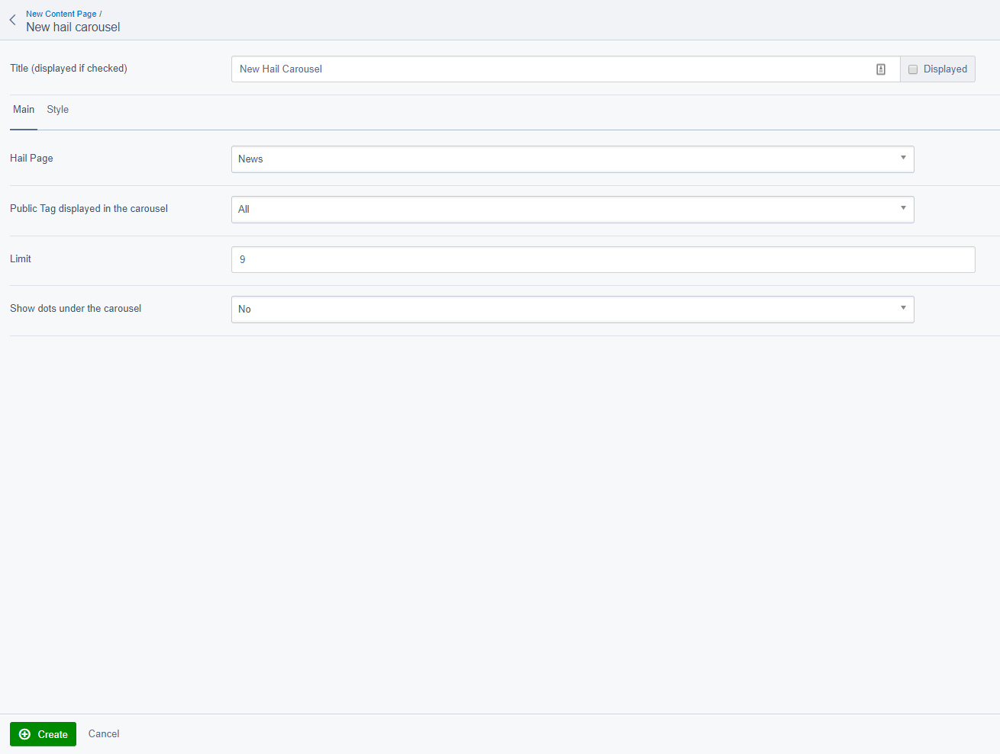
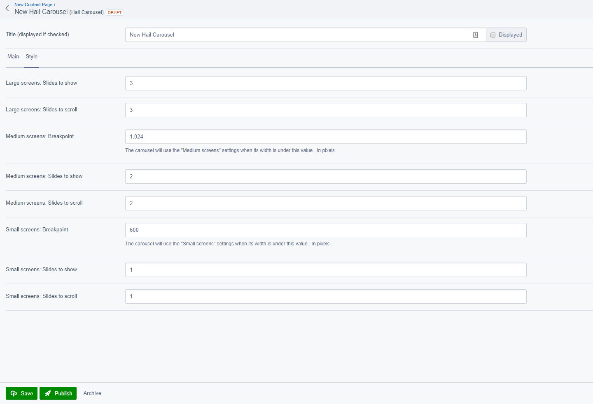

# Elemental module for SilverStripe Hail

Silverstripe 4 module to integrate the Hail module in SilverStripe Elemental 

## Features

* Add a new element to Elemental type: Hail Carousel
* Ready to use with Bootstrap 4.1 styles and templates
* Responsive configuration for the Carousel
* Mobile friendly using touch events to slide and responsive design

## Requirements

* [firebrandhq/silverstripe-hail ^4.0](https://github.com/firebrandhq/silverstripe-hail)
* [dnadesign/silverstripe-elemental ^2.0](https://github.com/dnadesign/silverstripe-elemental)
* [sheadawson/silverstripe-dependentdropdownfield ^2.0](https://github.com/sheadawson/silverstripe-dependentdropdownfield)
* jQuery and Bootstrap 4.1+ (included from the SilverStripe Hail module), [see jQuery and Boostrap requirements](#jquery-and-bootstrap-requirements)

## Installation

**Run the following command:**

```sh
composer require firebrandhq/silverstripe-hail-elemental "^1.0"
```

**Perform a dev/build (from sake or from a browser)**

## jQuery and Bootstrap requirements

We include jQuery 3.3.1 and Bootstrap 4.1 (javascript and css) from our SilverStripe Hail module

If you need to include your own jQuery and/or Bootstrap (If you compiled Bootstrap from source or want to include those globally for example), simply block our requirement(s) by adding one or all the following to your PageController init() function:

```php
protected function init()
{
    parent::init();
    // You can include any CSS or JS required by your project here.
    // See: https://docs.silverstripe.org/en/developer_guides/templates/requirements/
    
    \SilverStripe\View\Requirements::block('firebrand/silverstripe-hail: thirdparty/bootstrap/styles/bootstrap.min.css');
    \SilverStripe\View\Requirements::block('firebrand/silverstripe-hail: thirdparty/jquery/js/jquery.min.js');
    \SilverStripe\View\Requirements::block('firebrand/silverstripe-hail: thirdparty/bootstrap/js/bootstrap.bundle.min.js');
}
```

## Usage

If SilverStripe Elemental is enabled on the page you should see a Hail Carousel option in the list of elements you can add.
The configuration of the Hail Carousel should be self explanatory, see screenshot below. 

You can configure the responsive breakdowns and carousel behavior from the *Style* tab.
Hail Carousel configuration:





Once configured and published your Hail Carousel should look like this (using default styles and templates):


## Contributing

[See CONTRIBUTING.md](CONTRIBUTING.md)

## Versioning

This library follows [Semver](http://semver.org). According to Semver, you will be able to upgrade to any minor or patch version of this library without any breaking changes to the public API. Semver also requires that we clearly define the public API for this library.

All methods, with `public` visibility, are part of the public API. All other methods are not part of the public API. Where possible, we'll try to keep `protected` methods backwards-compatible in minor/patch versions, but if you're overriding methods then please test your work before upgrading.

## Reporting Issues

Please [create an issue](https://github.com/firebrandhq/silverstripe-hail-elemental/issues) for any bugs you've found, or features you're missing.  

## Credits

[Slick Carousel by kenwheeler](https://github.com/kenwheeler/slick/)